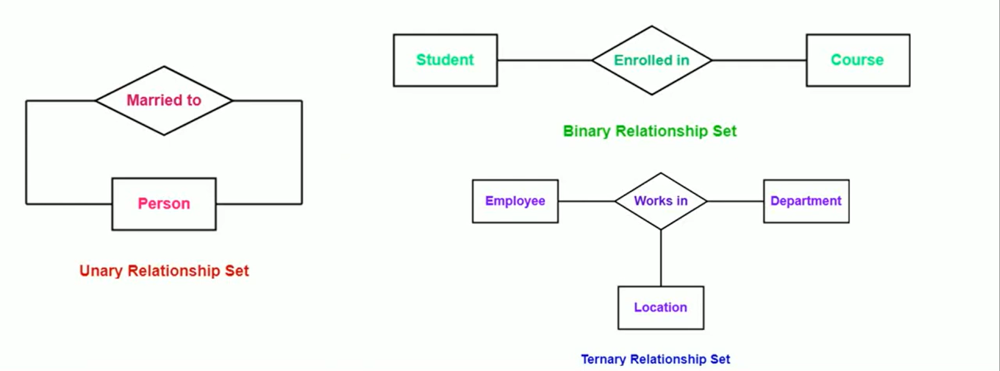
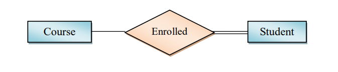

# Entity Relationship Model (ER Model)

---

# Content

1. [Data Model](#data-model)
2. [ER Model](#er-model)
3. [Entities](#entities)
4. [Attributes](#attribute)
5. [Relationships](#relationship)

---

# Data Model

A data model in DBMS is a way of describing how data is organized, stored, related, and accessed in a database.

In simple terms a data model defines the structure of a database and the relationships between its data.

> Think of it as a blueprint of the database.

### Example

Suppose we are building a college database:

- Students
- Courses
- Teachers

A data model defines things like:

```
Student
 ├── Student_ID
 ├── Name
 └── Course_ID
          │
          ▼
       Course
        ├── Course_ID
        └── Course_Name
```

It tells the DBMS what entities exist, what attributes they have, and how they are related.

> An entity is a real-world object or thing about which we store data in a database, such as a Student, Employee, or Product.

### Main types of data models

1. **Hierarchical Model**
    - Data is organized like a tree.
    - One parent can have multiple children.

    ```
    College
    ├── Department
    │   ├── Student
    │   └── Teacher
    ```

2. **Network Model**
    - Data is represented as a graph.
    - Supports many-to-many relationships.

3. **Relational Model**
    - Data is stored in tables (rows and columns).
    - Used by MySQL, PostgreSQL, Oracle, SQL Server, etc.

    ```
    STUDENT
    +----+--------+------+
    | ID | Name   | Age  |
    +----+--------+------+
    | 1  | Rahul  | 20   |
    | 2  | Amit   | 21   |
    +----+--------+------+
    ```

4. **Object-Oriented Model**
    - Data is represented as objects, similar to OOP concepts.

5. **ER (Entity-Relationship) Model**
    - Represents entities, attributes, and relationships.
    - Commonly used during database design before creating actual tables.

### Data model is complete if it answer three questions

1. **Storage — How is the data stored?**
    - Defines the structure and organization of data in the database.
    - Example: In the relational model, data is stored in tables consisting of rows and columns.

2. **Data Manipulation Language — How can we manipulate the data?**
    - Defines the operations that can be performed on the stored data, such as:
        - Create/Insert data
        - Read/Select data
        - Update data
        - Delete data
    - For example, SQL provides commands such as `INSERT`, `SELECT`, `UPDATE`, and `DELETE`.

3. **Integrity Constraints — What restrictions ensure data is correct?** 
- Defines rules that the data must follow to maintain accuracy, consistency, and validity. 
- Types of Integrity Constraints: 
    - **Domain Integrity**: 
        - Ensures that a column contains only valid values according to its defined domain/type. 
        - Example: Age should be an integer and cannot be negative. 
    - **Entity Integrity**: 
        - Ensures that every row can be uniquely identified. 
        - Example: A primary key cannot be NULL. 
    - **Referential Integrity**: 
        - Ensures that relationships between tables remain valid. 
        - Example: A foreign key must refer to an existing primary key (or valid candidate key) in the referenced table, unless NULL is allowed. 
    - **Key Constraints**: 
        - Ensure that key values uniquely identify records. 
        - Example: Two students cannot have the same Student_ID if it is a candidate/primary key.
        
    > A data model defines three main aspects: how data is stored, how data can be manipulated, and what integrity constraints must be followed to maintain correct and consistent data.

[Go To Top](#content)

---

# ER Model

ER (Entity-Relationship) Model is a high level data model used to design a database by representing collection of basic object called entities, their attributes, and the relationships between them.

> high level data model: even a non-technical person can understand this data model

For example:

```
Student ──── enrolls in ──── Course
  │                           │
  ├── Student_ID              ├── Course_ID
  └── Name                    └── Course_Name
```

Here:

- Student and Course → Entities
- Student_ID, Name → Attributes
- Enrolls in → Relationship

### Not a complete data model

Previously, we learned that a **data model is considered complete when it specifies three main aspects**:

1. **Storage** — How is the data structured and stored?
2. **Data Manipulation Language (DML)** — How can we perform operations such as Create, Read, Update, and Delete on the data?
3. **Integrity Constraints** — What rules and restrictions must the data follow to maintain correctness and consistency?

However, the **ER (Entity-Relationship) Model is not a complete data model in this sense**. It is primarily a **conceptual/design model** used to describe the structure of a database at a high level.

The ER model describes:

- **Entities** — What objects or things exist in the system.
- **Attributes** — What properties or information are associated with those entities.
- **Relationships** — How different entities are connected to each other.
- **Constraints** — Rules that define how entities can participate in relationships.

The ER model **does not specify the actual storage mechanism or a data manipulation language**. These details are handled when the conceptual design is mapped to a specific data model, such as the **Relational Model**, and then implemented in a DBMS.

**In short:**

> **ER Model = Conceptual blueprint of the database, not the complete implementation-level data model.**

### Why Study the ER Model?

Even though the **ER model is not a complete data model**, it provides a **high-level conceptual design of the database**.

This conceptual design can then be **mapped to the Relational Model** (complete data model), which provides the structure, data manipulation operations, and integrity constraints required for implementing the database in a DBMS.

**In short:**

> **ER Model → High-level database design → Relational Model → Database implementation**

[Go To Top](#content)

---

# Entities

An **entity** is a real-world object or concept about which we want to store information.

**Examples:**

- Student
- Teacher
- Course
- Employee
- Product

### 1. Entity Type

An **entity type** is a definition or structure that describes a particular type of entity and its attributes.

**Example:**

```text
Student
├── Student_ID
├── Name
├── Age
└── Email
```

Here, **Student** is an entity type, and `Student_ID`, `Name`, `Age`, and `Email` are its attributes.

> Think of an entity type as a **class or blueprint**.

Entity types are commonly classified into two types:

1.  **Strong Entity Type**
    - A **strong entity type** can exist independently and has a **key attribute** that can uniquely identify each entity instance.

    - **Example:**

        ```text
        ┌──────────┐
        │  STUDENT │
        └──────────┘
        ```

    - If `Student_ID` uniquely identifies every student, then `Student` is a strong entity type.
    - **Symbol:** Single rectangle.

2.  **Weak Entity Type**
    - A **weak entity type** cannot be uniquely identified using its own attributes alone. It depends on a **strong entity type** for its identification.

    - **Example:**\
      An `Order` can contain multiple `Order_Items`.

        ```text
        Order ─────── Order_Item
        ```

        Suppose:

        ```text
        Order_ID = 101
        ```

        and the items in that order are:

        ````text
        Item_No = 1
        Item_No = 2
            ```

        `Item_No` alone cannot uniquely identify an order item because another order can also have `Item_No = 1`.
        Therefore, we can identify the order item using:
        ```text
        Order_ID + Item_No
        ````

        Here, `Order_ID` comes from the strong entity `Order`, while `Item_No` is the **partial key** of the weak entity.

    - **Symbol:** Double rectangle.

        ```text
        ╔════════════╗
        ║ ORDER ITEM ║
        ╚════════════╝
        ```

> A weak entity depends on a strong entity for its identification.

### 2. Entity Instance

An **entity instance** is a specific individual occurrence of an entity type.

**Example:**

```text
Student_ID: 101
Name: Rahul
Age: 20
Email: rahul@gmail.com
```

This particular student is **one entity instance** of the `Student` entity type.

> Think of an entity type as a **class** and an entity instance as an **object created from that class**.

### 3. Entity Set

An **entity set** is a collection of entity instances of the same entity type at a particular point in time.

**Example:**

```text
Student Entity Set

101 | Rahul | 20
102 | Amit  | 21
103 | Priya | 20
104 | Neha  | 22
```

All four students together form the **Student entity set**.

### Summary

| Term                   | Meaning                                    | Example                   |
| ---------------------- | ------------------------------------------ | ------------------------- |
| **Entity Type**        | Definition/structure of an entity          | `Student`                 |
| **Entity Instance**    | One specific occurrence                    | `Student_ID = 101, Rahul` |
| **Entity Set**         | Collection of instances                    | All students              |
| **Strong Entity Type** | Can be identified independently            | `Student`                 |
| **Weak Entity Type**   | Requires another entity for identification | `Order_Item`              |

[Go To Top](#content)

---

# Attribute

An attribute is a property or characteristic that describes an entity.

For the `Student` entity:

```
Student
 ├── Student_ID
 ├── Name
 ├── Age
 └── Email
```

Here:

- Student_ID
- Name
- Age
- Email

are attributes of the `Student` entity.

Simple definition:

> Entity = What we store information about\
> Attribute = What information we store about it

### Domain

Domain of an attribute is the set of all valid values that the attribute can take.

Example\
For a `Student` entity:

```
Age → Domain = {1, 2, 3, ..., 100}
```

This means `Age` can only contain values within the defined valid range.

Another examples:

```
Gender → Domain = {Male, Female, Other}

Student
├── Age      → Domain: 1–100
├── Name     → Domain: valid text strings
└── Email    → Domain: valid email strings
```

### Types of Attributes

attributes are commonly classified into 5 types:

1. **Simple (Atomic) Attribute**
    - An attribute that cannot be divided into smaller meaningful parts.
    - Example:
        ```
        Age
        Salary
        Gender
        ```
        `Age` cannot meaningfully be divided further.
    - Symbol: Single oval.
2. **Composite Attribute**
    - An attribute that can be divided into smaller attributes.
    - Example:
        ```
        Name
        ├── First_Name
        ├── Middle_Name
        └── Last_Name
        ```
        Here, `Name` is a composite attribute.
    - Symbol: Oval connected to smaller ovals
3. **Single-Valued Attribute**
    - An attribute that has only one value for each entity instance.
    - Example:
        ```
        Student_ID = 101
        ```
        A student has one `Student_ID`.
    - Symbol: Single oval
4. **Multi-Valued Attribute**
    - An attribute that can have multiple values for a single entity instance.
    - Example:
        ```
        Student
        Phone_Number = {9876543210, 9123456780}
        ```
        A student can have multiple phone numbers.
    - Symbol: Double oval.

5. **Derived Attribute**
    - An attribute whose value can be calculated from another attribute or attributes.
    - Example:
        ```
        Date_of_Birth → Age
        ```
        If we know the student's date of birth, we can calculate their current age.
    - Symbol: Dashed oval.
6. **Key Attribute**
    - A key attribute is an attribute whose value uniquely identifies each entity instance within an entity set.
    - Example:
        ```
        Student
        ├── Student_ID  ← Key Attribute
        ├── Name
        ├── Age
        └── Email
        ```
        Each `Student_ID` is unique, so it can identify a particular student.
    - Symbol: Single oval with underlining the attribute name
    - Type of keys:
        1. **super key:**
            - Any attribute or combination of attributes that uniquely identifies a particular instance of entity type.
            - It may contain unnecessary attributes.
            - Even if we remove those unnecessary attribute we will still be able to uniquely identify a particular instance of entity type.
            - Example: `{student_id}` and `{student_id, name}`.
        2. **candidate key:**
            - A minimal attribute or combination of attributes that can uniquely identify a particular instance of entity type.
            - A table can have multiple candidate keys.
            - If you remove even a single attribute from the set you'll not be able to uniquely identify any particular instance of entity type.
            - Example: `student_id` and `email`, if both are unique.
                > every candidate key is a super key but not every super key is a candidate key
        3. **Primary Key:**
            - Uniquely identifies each record in a table.
            - It cannot contain NULL or duplicate values.
            - A entity type (table) can have only one primary key constraint.
            - It is a candidate key selected as the main identifier.
            - Example: `student_id`
                > A candidate key is any minimal key that can uniquely identify a record, whereas a primary key is the candidate key selected to identify records in a table.
        4. **Foreign Key:**
            - An attribute that references a primary key or another eligible unique key in another (or the same) entity type (table).
            - It maintains referential integrity (A foreign key must reference an existing primary kay in the parent table or be NULL if permitted.).
            - Can have duplicate or NULL values
            - Example: `department_id` in the Student table references `department_id` in the Department table.

### Summary

| Attribute Type         | Definition                                                                   | Example                                     | Symbol                                  |
| ---------------------- | ---------------------------------------------------------------------------- | ------------------------------------------- | --------------------------------------- |
| **1. Simple (Atomic)** | An attribute that **cannot be divided** into smaller meaningful parts.       | `Age`, `Salary`, `Gender`                   | **Single oval**                         |
| **2. Composite**       | An attribute that **can be divided** into smaller meaningful attributes.     | `Name → First_Name, Middle_Name, Last_Name` | **Oval connected to smaller ovals**     |
| **3. Single-Valued**   | An attribute that has **only one value** for each entity instance.           | `Student_ID = 101`                          | **Single oval**                         |
| **4. Multi-Valued**    | An attribute that can have **multiple values** for a single entity instance. | `Phone_Number = {9876..., 9123...}`         | **Double oval**                         |
| **5. Derived**         | An attribute whose value is **calculated from another attribute(s)**.        | `Date_of_Birth → Age`                       | **Dashed oval**                         |
| **6. Key Attribute**   | An attribute whose value **uniquely identifies** each entity instance.       | `Student_ID`                                | **Oval with underlined attribute name** |

[Go To Top](#content)

---

# Relationship

A relationship describes the association between two or more entities.

symbol: diamond (◇)

> According to the definition, it's present between instance of entity type but entity instance have no symbols in ER model, so we show them using entity type

For example:

```
Student ───── enrolls in ───── Course
```

Here:

- Student → Entity
- Course → Entity
- Enrolls in → Relationship

### Type of relationship:

In an ER (Entity-Relationship) model, unary, binary, and ternary relationships are classified based on the number of entity types participating in a relationship.



1. **Unary Relationship (Degree 1)**
    - A unary relationship occurs when an entity type is related to itself. It is also called a recursive relationship.
    - Example: An employee manages another employee.
        - Entity: Employee
        - Relationship: Manages
        - Degree: 1 (Unary)
    - Both sides involve the same entity type, Employee, although the employees can be different individuals.

2. **Binary Relationship (Degree 2)**
    - A binary relationship occurs when two entity types participate in a relationship.
    - Example: A student enrolls in a course.
        - Entity 1: Student
        - Entity 2: Course
        - Relationship: Enrolls
        - Degree: 2 (Binary)
    - This is the most common type of relationship in ER diagrams.
3. **Ternary Relationship (Degree 3)**
    - A ternary relationship occurs when three entity types participate in the same relationship simultaneously.
    - Example: A supplier supplies a particular part to a particular project.
        - Entity 1: Supplier
        - Entity 2: Part
        - Entity 3: Project
        - Relationship: Supplies To
        - Degree: 3 (Ternary)
    - The relationship captures the combination of the supplier, part, and project together.

### Cardinality in binary relationship
Cardinality in a binary relationship tells us how many entities can be related to each other when two entity types participate in a relationship.

>Cardinality specifies how many entities of one type can be related to an entity of another type.

1. **One-to-One (1:1)**
    - One entity is associated with at most one entity of another type, and vice versa.
    - Example: One man can marry only one one woman
2. **One-to-Many (1:N)**
    - One entity can be associated with many entities of another type, but each of those entities is associated with at most one entity on the first side.
    - Example: One department has many employees, but one employee can not work in many department.
3. **Many-to-One (N:1)**
    - Many entities of one type can be associated with a single entity of another type.
    - Example: Many employees work in one department.
    - It is just a reverse of **one to many**
4. **Many-to-Many (M:N)**
    - Many entities of one type can be associated with many entities of another type.
    - Example: Many students enroll in many courses.

| Cardinality | Meaning      | Example                |
| ----------- | ------------ | ---------------------- |
| 1:1         | One to one   | Person — Passport      |
| 1:N         | One to many  | Department — Employees |
| N:1         | Many to one  | Employees — Department |
| M:N         | Many to many | Students — Courses     |


### Total Participation
Total participation is a constraint in an ER (Entity-Relationship) diagram where every entity in an entity set must participate in at least one relationship.

In simple words, no entity can exist in that entity set without being involved in the specified relationship.

**symbol: double line**

**Example**

Consider two entities: `Employee` and `Department`.
```
┌──────────┐                         ┌────────────┐
│ Employee │======= Works_In ======> │ Department │
└──────────┘                         └────────────┘
```
For this example:
- Every `employee` must work in at least one `department`.
- An `employee` cannot exist without participating in the `Works_In` relationship.
- Therefore, `Employee` has total participation in `Works_In`.

Total participation implies a minimum cardinality of 1 for the participating entity set in that relationship.

> Minimum cardinality of 1 means every entity must participate in the relationship at least once.

### Partial Participation
Partial participation is a constraint in an ER diagram where some entities may not participate in a particular relationship.

In simple words, participation in the relationship is optional.

**symbol: single line**

**Example**

Suppose we have two entities: `Employee` and `Department`, with a relationship called `Manages`.
```
┌──────────┐                         ┌────────────┐
│ Employee │────── Manages ────────> │ Department │
└──────────┘                         └────────────┘
```
- Some employees manage a department.
- Other employees do not manage any department.

Therefore, `Employee` has partial participation in the `Manages` relationship.

### Total vs. Partial Participation



here:
- course to enrolled = partial participation
- student to course = total participation

explanation
- A course may exist without any student (partial participation)
- Every student must be enrolled in at least one course (total participation)

| Total participation                                  | Partial participation                             |
| ---------------------------------------------------- | ------------------------------------------------- |
| Participation is mandatory.                          | Participation is optional.                        |
| Minimum cardinality = 1                              | Minimum cardinality = 0                           |
| Represented by a double line.                        | Represented by a single line.                     |
| Example: Every employee must belong to a department. | Example: Not every employee manages a department. |

### Descriptive Attribute

A descriptive attribute is an attribute that describes a property of a relationship between entities, rather than a property of an individual entity.

**Example**

Suppose we have two entities: `Student` and `Course`, connected by an `Enrolls` relationship.
- A student has attributes like `Student_ID` and `Name`.
- A course has attributes like `Course_ID` and `Course_Name`.
- The relationship Enrolls can have attributes like `Enrollment_Date` and `Grade`.

Here, `Enrollment_Date` and `Grade` are descriptive attributes because they describe the relationship between a particular student and a particular course.


### Why do we need Descriptive Attribute?
Descriptive attributes are needed to store information specific to a relationship between entities, especially when that information varies for each relationship instance.

**Example: Student and Course**

Suppose a student enrolls in multiple courses.
- `Student`: Student_ID, Name
- `Course`: Course_ID, Course_Name
- `Enrolls`: Enrollment_Date, Grade

Why do we need descriptive attributes here?

Imagine Rahul enrolls in Java on 10 June and Python on 15 June.

| Student | Course | Enrollment Date | Grade |
| ------- | ------ | --------------- | ----- |
| Rahul   | Java   | 10 June         | A     |
| Rahul   | Python | 15 June         | B     |

Notice that the enrollment date and grade can differ for each student-course combination.

* Enrollment_Date tells us when the student enrolled in a particular course.

* Grade tells us the student's result in that particular course.

We cannot store these attributes directly in `Student`, because one student can enroll in multiple courses with different dates and grades.

We cannot store them directly in `Course`, because multiple students can enroll in the same course and receive different grades.

Therefore, we associate these attributes with the `Enrolls` relationship.

> Entity attributes describe what an entity is; descriptive attributes describe what happens between entities.


[Go To Top](#content)

---

