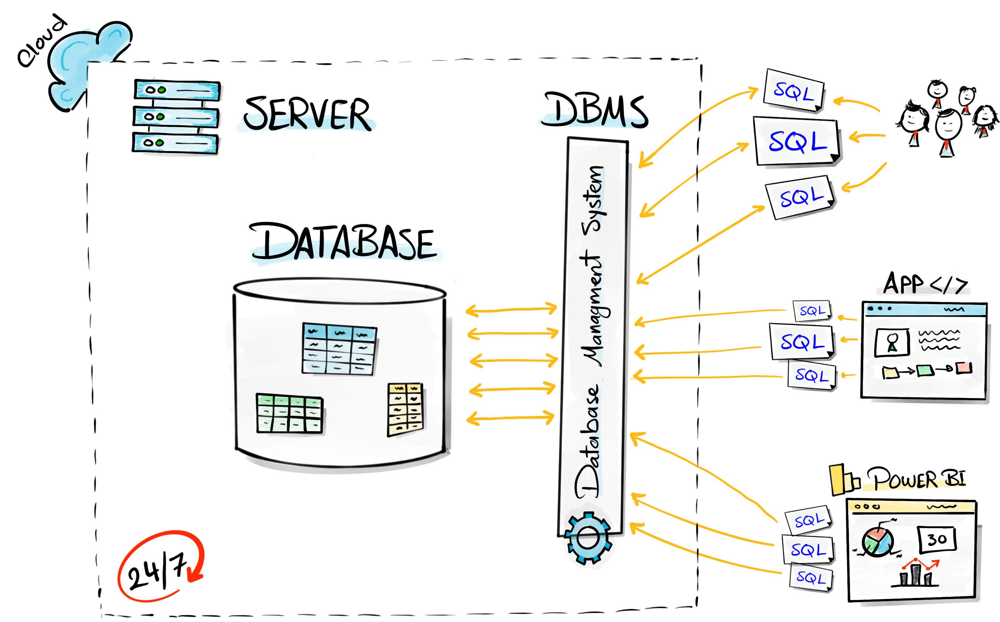

# Content

1. [Data vs Information](#data-vs-information)
2. [Database](#database)
3. [DBMS (Database Management System)](#dbms-database-management-system)
4. [File System as Database](#file-system-as-database)
5. [DBMS vs File System](#dbms-vs-file-system)
6. [Database System](#database-system)

---

# Data vs Information

Data is a collection of raw facts and values stored in a database, whereas information is meaningful knowledge obtained by processing and organizing that data.

### What is Data?

Data consists of raw, unorganized facts and details. This includes text, figures, observations, symbols, and descriptions.

- Data lacks a specific purpose.
- Data has no significance by itself.
- Measured in bits and bytes.
- Data on its own is meaningless. It requires processing to extract value and meaning.
- Without context, it is simply a collection of recorded facts.

### What is Information?

Information is processed, organized, and meaningful data that provides useful knowledge or understanding.

- Information has a specific purpose and meaning.
- Information is obtained by processing and organizing data.
- Information helps in decision-making and analysis.
- Information provides context and makes data useful.
- Information is usually measured based on its usefulness, accuracy, and relevance rather than simply in bits and bytes.

**Example:**

Data:

```text
85, 72, 91, 68, 78
```

Information:

```text
The average marks of the students is 78.8, and the highest score is 91.
```

**In simple terms:**

> **Data = Raw facts**\
> **Information = Processed and meaningful data**

### Data Vs Information

| Feature        | Data                            | Information               |
| -------------- | ------------------------------- | ------------------------- |
| Meaning        | Raw facts                       | Processed data            |
| Organization   | Unorganized                     | Organized                 |
| Purpose        | May not have a specific purpose | Has a specific purpose    |
| Meaningfulness | May not have meaning by itself  | Has meaningful context    |
| Processing     | Input to processing             | Result of processing      |
| Use            | Used to generate information    | Used for decision-making  |
| Example        | `85, 72, 91, 68`                | `91 is the highest score` |

> Data does not depend on information; however, information depends on data. Data in a foundation upon which information is built

[Go To Top](#content)

---

# Database

A database is an organized collection of data that is stored electronically so that it can be easily accessed, managed, updated, and retrieved.

### Simple example

A college might have a database containing student information:
| ID | Name | Course | Age |
| --- | ------- | ------ | --: |
| 101 | Yadnesh | IT | 20 |
| 102 | Rahul | CS | 21 |
| 103 | Amit | IT | 20 |

Instead of keeping this information in separate files, a database stores it in an organized structure.

> Data → individual facts\
> Database → organized collection of related data

### Type of Database

Databases can be classified in different ways. The most important classification is based on the **data model**.

| Type                            | Description                                                         | Examples                  |
| ------------------------------- | ------------------------------------------------------------------- | ------------------------- |
| **Hierarchical Database**       | Data is organized like a **tree**, using parent-child relationships | IBM IMS                   |
| **Network Database**            | Data is organized as a **network**, allowing multiple relationships | IDMS                      |
| **Relational Database (RDBMS)** | Data is stored in **tables** with rows and columns                  | MySQL, PostgreSQL, Oracle |
| **Object-Oriented Database**    | Data is stored as **objects**, similar to OOP concepts              | ObjectDB                  |
| **Non-Relational Database (NoSQL)**              | Data is not stored in traditional tables and supports flexible data models   | MongoDB, Redis, Cassandra |

### Structured vs Semi-Structured vs Unstructured Data

| Feature            | Structured Data      | Semi-Structured Data | Unstructured Data                |
| ------------------ | -------------------- | -------------------- | -------------------------------- |
| Structure          | Fixed and organized  | Partially organized  | No fixed structure               |
| Schema             | Predefined           | Flexible             | No predefined schema             |
| Examples           | Tables, spreadsheets | JSON, XML            | Images, videos, audio, documents |
| Commonly used with | RDBMS                | NoSQL databases      | File/Object storage              |

**Simple examples**

**Structured:**

```text
Student
┌────┬─────────┬─────┐
│ ID │ Name    │ Age │
├────┼─────────┼─────┤
│ 1  │ Yadnesh │ 20  │
│ 2  │ Rahul   │ 21  │
└────┴─────────┴─────┘
```

Every record follows the same predefined structure.

**Semi-Structured:**

```json
{
  "name": "Yadnesh",
  "age": 20,
  "skills": ["Java", "Python"]
}
```

The structure is flexible, and different records can have different fields.

**Unstructured:**

```text
Photo.jpg
Video.mp4
Resume.pdf
Song.mp3
```

The data does not follow a predefined tabular structure.

[Go To Top](#content)

---

# DBMS (Database Management System)

DBMS (Database Management System) is a software that allows us to create, store, manage, retrieve, and update data in a database.

Think of it this way:

```
Database → Stores the data
DBMS     → Manages the database
```

> The primary goal of a DBMS is to provide a way to store and retrieve database information that is both convenient and efficient

### Example
Suppose you have a student database:

```
Student
101 | Yadnesh | IT
102 | Rahul   | CS
```

A DBMS lets you perform operations such as:

```sql
SELECT * FROM Student;
UPDATE Student SET Course = 'CS' WHERE ID = 101;
DELETE FROM Student WHERE ID = 102;
```



### Examples of DBMS:

- MySQL
- PostgreSQL
- Oracle Database
- Microsoft SQL Server
- MongoDB (technically a NoSQL DBMS/database system)

[Go To Top](#content)

---

# File System as Database

Before DBMS, data was commonly stored and managed using a file system. In a file system, data is stored in separate files on the computer's storage.

For example, a college might store:

```
students.txt
teachers.txt
courses.txt
fees.txt
```

Each file contains related data.

### Problems with File System

- Data redundancy – Same data may be stored in multiple files.
- Data inconsistency – Updating data in one file but not another can cause different values.
- Difficult data access – Finding and retrieving specific data can be difficult.
- Poor security – Controlling who can access specific data is difficult.
- No proper data relationships – Connecting data between different files is difficult.
- Difficult concurrent access – Multiple users accessing/updating files can cause problems.
- Data isolation – Data is scattered across different files and formats.
- Backup and recovery problems – Recovering data after failures can be difficult.

### Concurrency Problem in File System

Concurrency means multiple users or processes accessing or modifying the same data at the same time.

In a traditional file system, handling simultaneous updates can be difficult and may result in incorrect or lost data.

Example\
Suppose a bank has a file containing:

```
Account Balance = ₹10,000
```

Two operations happen at the same time:

```
User A → Withdraw ₹3,000
User B → Withdraw ₹5,000
```

Both users may read the balance as ₹10,000 before either update is saved.

They might calculate:

```
User A: 10,000 - 3,000 = 7,000
User B: 10,000 - 5,000 = 5,000
```

If User B's update overwrites User A's update, the final balance becomes:

```
₹5,000
```

But the correct balance should be:

```
₹2,000
```

This is called a lost update problem.

> Concurrency problems can be caused by race conditions. A race condition occurs when the result depends on the timing/order in which multiple processes access or modify shared data.

[Go To Top](#content)

---

# DBMS vs File System

A file system can store data, but it lacks the powerful features required to efficiently manage large, shared, and related data. That's why DBMS was introduced.

DBMS solves the problems of the traditional file system by providing structured data management, concurrency control, security, integrity, backup, and efficient data access.

### File System Problems → DBMS Solutions

| Problem in File System         | How DBMS Solves It                                                                   |
| ------------------------------ | ------------------------------------------------------------------------------------ |
| **Data Redundancy**            | Reduces duplicate data through proper database design and normalization              |
| **Data Inconsistency**         | Keeps data consistent using constraints and controlled updates                       |
| **Concurrency Problems**       | Uses **transactions, locks, and isolation** to safely handle multiple users          |
| **Difficult Data Access**      | Provides **SQL** to easily search and retrieve data                                  |
| **Data Isolation**             | Stores related data in a structured database and allows relationships between tables |
| **Security Problems**          | Provides **authentication, authorization, roles, and permissions**                   |
| **Integrity Problems**         | Uses constraints like **PRIMARY KEY, FOREIGN KEY, UNIQUE, NOT NULL, CHECK**          |
| **Backup & Recovery Problems** | Provides **backup, logging, and recovery mechanisms**                                |
| **Atomicity Problems**         | Uses **transactions** to ensure operations are completed fully or not at all         |
| **Data Sharing Problems**      | Allows multiple users/applications to safely access the same database                |

### The important one: Concurrency

```
User A ──┐
         ├──→ DBMS → Controls access → Database
User B ──┘
```

The DBMS can use locking and transaction isolation so that User A and User B don't incorrectly overwrite each other's changes.

Example\
Suppose:

```
Balance = ₹10,000
```

User A wants to withdraw ₹3,000.

```
User A
  ↓
Requests X (exclusive) lock
  ↓
DBMS gives lock
  ↓
Reads ₹10,000
  ↓
Updates → ₹7,000
  ↓
Commits
  ↓
Releases lock
```

Now User B wants to withdraw ₹5,000.

If B tries while A has the exclusive lock:

```
User A → 🔒 Balance
User B → ⏳ Wait
```

After A finishes:

```
User A → Unlock
User B → 🔒 Lock
User B → Reads ₹7,000
User B → Updates → ₹2,000
```

So we get the correct final balance: ₹2,000.

> DBMS solves the limitations of file systems by providing mechanisms for data security, integrity, concurrency control, reduced redundancy, efficient data retrieval, transaction management, and backup and recovery.

[Go To Top](#content)

---

# Database System

A database system is the combination of the database, DBMS, and the applications/users that interact with the database.

Think of it as:

```
Database System
│
├── Database → Stores the data
├── DBMS → Manages the data
└── Users / Applications → Interact with the data
```

> A database system is a collection of the database, DBMS, applications, and users that work together to store, manage, and access data.

### Example

For a college management system:

```
Student App
     ↓
   DBMS
     ↓
 Database
 ┌──────────────┐
 │ Students     │
 │ Teachers     │
 │ Courses      │
 │ Fees         │
 └──────────────┘
```

- **Database** → contains student, teacher, course, and fee data.
- **DBMS** → manages that data and handles queries, security, transactions, concurrency, etc.
- **Application** → provides an interface for students/admins to interact with the data.

### Don't confuse these three

| Term                | Meaning                              |
| ------------------- | ------------------------------------ |
| **Database**        | Collection of organized data         |
| **DBMS**            | Software that manages the database   |
| **Database System** | Database + DBMS + applications/users |

[Go To Top](#content)

---
