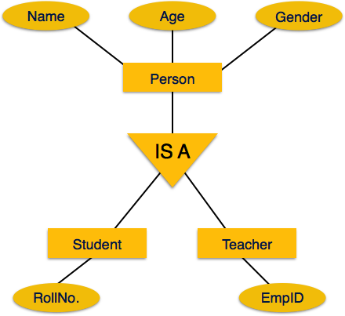

# Extended Entity Relationship Model (EER Model)

---

# Content

1. [Introduction](#introduction)
2. [Generalization / specialization](#generalization--specialization)
3. [Aggregation](#aggregation)

---

# Introduction

The Extended Entity-Relationship (EER) Model is an advanced version of the ER model that supports additional concepts to represent complex real-world data more accurately.

In simple words, the normal ER model represents entities, attributes, and relationships. The EER model adds concepts such as specialization, generalization, and aggregation to represent more complex situations.

### 1. Example of a normal ER model

Suppose a college has students and teachers.

```
Student ───── Studies ─────> Course
```

This represents entities and the relationship between them.

### 2. Example of an Extended ER model

Now suppose students can be undergraduate or postgraduate students, and employees can be teachers or administrative staff.

The EER model lets us represent these categories using specialization and generalization.

Where person is the superclass; Student and Employee are subclasses.

>This is an EER concept because it models more complex relationships between entity types.

## 3. Main concepts of the EER model

| Concept        | Meaning                                                                       | Example                                           |
| -------------- | ----------------------------------------------------------------------------- | ------------------------------------------------- |
| Specialization | Dividing one entity into subtypes                                             | Employee → Manager, Developer                     |
| Generalization | Combining similar entities into a common superclass                           | Car, Bike → Vehicle                               |
| Aggregation    | Treating a relationship and its participating entities as a higher-level unit | Manager monitors an employee's project assignment |
| Inheritance    | Subclasses inherit attributes and relationships from the superclass           | Student inherits Person's name and age            |
| Constraints    | Rules governing subclasses                                                    | Disjoint/overlapping and total/partial            |

## 4. ER vs. EER model

| ER Model                             | EER Model                              |
| ------------------------------------ | -------------------------------------- |
| Basic conceptual data model          | Extended conceptual data model         |
| Entities, attributes, relationships  | All ER features plus advanced concepts |
| Suitable for simpler data structures | Better for complex data structures     |


>Remember: EER = ER model + advanced modeling concepts.

[Go To Top](#content)

---

# Generalization / specialization

In DBMS, Generalization and Specialization are concepts used in an ER diagram to represent relationships between a general entity and its more specific types.

**Symbol: Triangle**

> Generalization and specialization use the same symbol, and the difference is the direction of the relationship, not the symbol.

### 1. Generalization

Generalization is a bottom-up approach in which two or more similar entities are combined into one common, higher-level entity based on their shared attributes.

Example

Suppose we have two entities:

- `Car`: Registration_No, Color
- `Bike`: Registration_No, Color

Both share common attributes, so we create a generalized entity called `Vehicle`.

Why?\
Instead of defining the same common attributes separately for Car and Bike, we put them in the common entity `Vehicle`.

### 2. Specialization

Specialization is a top-down approach in which one higher-level entity is divided into two or more lower-level entities based on their specific characteristics.

Example

Suppose we have a general entity called `Employee`, with attributes `Employee_ID` and `Name`.

We divide it into two specialized entities:

- Manager: Bonus
- Developer: Programming_Language

Why?\
All employees share common attributes, but managers and developers can have their own additional attributes.

Both `Manager` and `Developer` inherit the common attributes of Employee.

### Attribute Inheritance
Attribute inheritance means that a specialize entity(sub class) automatically receives the attributes of its generalize entity (superclass).

**Example**

Suppose we have a superclass `Employee` and two subclasses, `Manager` and `Developer`.
Here:
- Employee has `Employee_ID`, `Name`, and `Salary`.
- Manager inherits all three attributes and has its own additional attribute, `Bonus`.
- Developer inherits all three attributes and has its own additional attribute, `Programming_Language`.

Therefore, a Manager doesn't need to redefine `Employee_ID`, `Name`, and `Salary`.

> Specialize entity does not have instance of their own, out all of the generalize entity we separate out the specialize entity into different type

### Participation Inheritance
Participation inheritance means that a specialize entity (subclass) inherits the participation constraints of its generalize entity (superclass) in an ER diagram.

In simple words, if a superclass participates in a relationship, its subclass also participates in that relationship because every subclass entity is also a member of the superclass.

**Example**

Suppose we have a superclass `Employee` and a subclass `Manager`.

- Every `Employee` must work in a `Department`.
- `Manager` is a subclass of `Employee`.

Therefore, every `Manager` must also work in a `Department`, because every manager is an employee.

### Generalization vs Specialization



here

- `Person` -> generalize entity
- `Student` / `Teacher` -> specialize entity

| Generalization                      | Specialization                      |
| ----------------------------------- | ----------------------------------- |
| Bottom-up approach                  | Top-down approach                   |
| Combines multiple entities          | Divides one entity                  |
| Identifies common features          | Identifies specific features        |
| Example: student + TEacher → Person | Example: Person → Student + Teacher |

### Constraints of Generalization / Specialization
There are two main constraints:
1. **Disjointness constraint**
    - It specifies whether an entity can belong to only one subclass or multiple subclasses.
    - There are two types:
        1. **Disjoint (D)**
            - An entity can belong to only one subclass.
            - Example: An `Employee` can be either a `PermanentEmployee` or a `ContractEmployee`, but not both.
        2. **Overlapping (O)**
            - An entity can belong to more than one subclass simultaneously.
            - Example: A `Person` can be both a `Student` and an `Employee`.

2. **Completeness constraint**
    - It specifies whether every entity in the superclass must belong to at least one subclass.
    - There are two types:
        1. **Total Specialization (Total Participation)**
            - Every entity in the superclass must belong to at least one subclass.
            - Example: Every `Vehicle` must be either a `Car` or a `Bike`.
        2. **Partial Specialization (Partial Participation)**
            - An entity in the superclass does not necessarily have to belong to any subclass.
            - Example: A `Vehicle` can be a `Car`, a `Bike`, or another vehicle type that is not represented by these subclasses.

[Go To Top](#content)

---
# Aggregation

Aggregation in DBMS is an abstraction concept in an ER model in which a relationship between entities is treated as a higher-level entity so that it can participate in another relationship.

In simple words, aggregation is like treating a relationship and its participating entities as one unit so that it can participate in another relationship.

### Example

Imagine this situation where there are 3 things in a company:
- Employee: Rahul
- Project: Website Development
-  Manager: Amit

Now, Rahul is working on the Website Development project, and Amit monitors Rahul's work on that project.

**Step 1: Create a relationship**
- Rahul works on the Website Development project.

    ```
    Employee (Rahul) ───── WOrks_on ─────> Project (Website Development)
    ```
- So far, everything is simple. We have two entities connected by a relationship.

**Step 2: Add the manager**
- Amit monitors Rahul's work on the Website Development project.
    ```
                                               ┌──────────────────────────────────────────────────────────────────────┐
      manager (Amit)  ────── Monitor ────────> │ Employee (Rahul) ───── WOrks_on ─────> Project (Website Development) │
                                               └──────────────────────────────────────────────────────────────────────┘
    ```
- Here's the important part: Amit isn't just monitoring Rahul in general, and he isn't just monitoring the project. He's monitoring Rahul's work on that particular project.

**Step 3: Where does aggregation come in?**
- Normally, a relationship connects entities. But here, we want another relationship (`Monitors`) to connect to an existing relationship (`Works_On`).
- Aggregation solves this problem by treating the existing relationship and its entities as one unit.

> Think of it like putting a box around this entire combination:\
>`Employee + Works_On + Project`\
>Now, the manager can have a relationship with that box.

### Without aggregation
continue with previous example Suppose we create these relationships:
- Manager monitors Employee.
- Manager monitors Project.

```

                   ┌───── Monitor ───── Employee (Rahul) ───────────────────┐

Manager (Amit) ────| WOrks_on
└───── Monitor ───── Project (Website Development) ──────┘

```
You have:
- Amit monitors Rahul.
- Amit monitors the Website Development project.
- Rahul works on the Website Development project.

These three facts are represented, but they don't necessarily tell us that Amit monitors Rahul's work specifically on the Website Development project.

The manager actually want to the Rahul's work, but here he doesn't actually managing Rahul's work, but is managing employee and Project separately

[Go To Top](#content)

---
