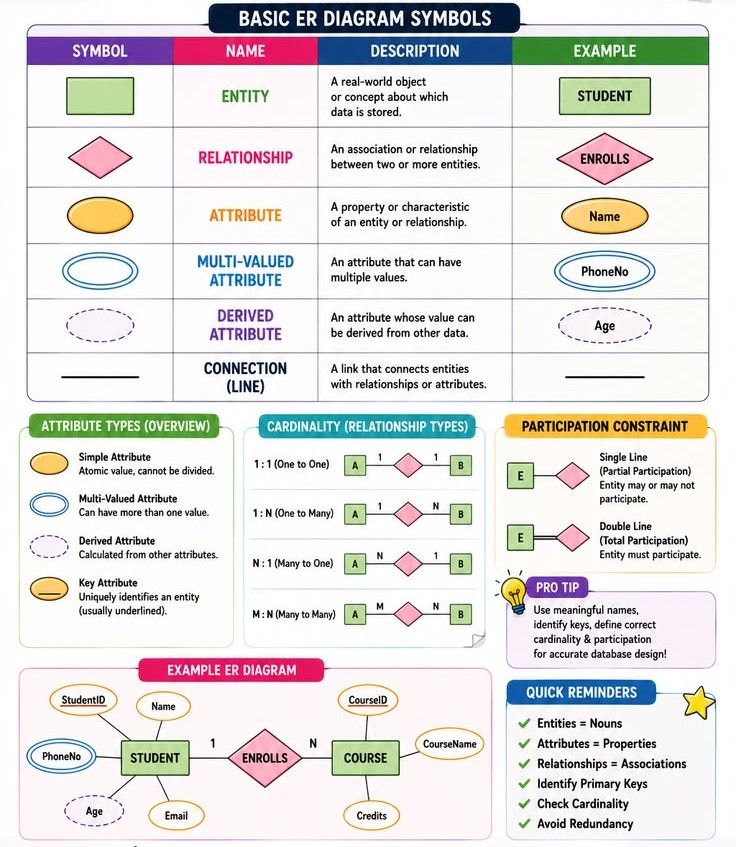
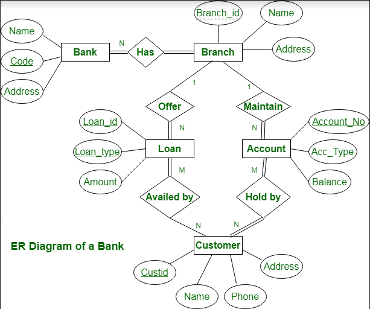

# Formulating an ER model

---
# Content
1. [Introduction](#introduction)
2. [Components Of ER diagram](#components-of-er-diagram)
3. [ER diagram of Bank Management System](#er-diagram-of-bank-management-system)


---
# Introduction

Formulating an ER model in DBMS means converting a real-world problem or requirements into an Entity-Relationship diagram using entities, attributes, relationships, and constraints.


### Step 1: Identify the entities

Entities are the main objects about which we store data.

Example: A college database stores information about students and courses.

- `Student`
- `Course`

### Step 2: Identify the attributes

Attributes are the properties that describe an entity.

For example:

- Student: `Student_ID (PK)`, `Name`, `Age`
- Course: `Course_ID`, `Course_Name`

>PK = Primary Key, which uniquely identifies each student.

Attributes are represented by ovals in a traditional ER diagram.


### Step 3: Identify the relationships

Determine how the entities interact with each other.

Example: A student enrolls in a course.

The relationship is `Enrolls`.

```
Student ───── Enrolls ─────> Course
```

In a traditional ER diagram, relationships are represented by diamonds.

### Step 4: Identify the cardinality

Cardinality tells us how many entities can participate in a relationship.

There are three common types:

| Type | Meaning      | Example                              |
| ---- | ------------ | ------------------------------------ |
| 1:1  | One-to-one   | One person has one passport          |
| 1:N  | One-to-many  | One department has many employees    |
| M:N  | Many-to-many | Many students enroll in many courses |

Example\
`Student` and `Course` have an M:N relationship, assuming each student can enroll in multiple courses and each course can have multiple students.

### Step 5: Identify participation constraints

Participation specifies whether participation in a relationship is mandatory or optional.

- Total participation: Every entity must participate in the relationship.
- Partial participation: Participation is optional for some entities.

Example: If every student must enroll in at least one course, Student has total participation in `Enrolls`. If a course can exist before any student enrolls, Course has partial participation.

These constraints depend on the actual requirements, so don't assume them automatically.

### Step 6: Identify keys and special requirements

- Select primary keys to uniquely identify entities.
- Identify multivalued attributes, such as multiple phone numbers.
- Identify weak entities if an entity depends on another entity for identification.
- Use specialization/generalization if the requirements include subtypes.


[Go To Top](#content)

---
# Components Of ER diagram
to learn in detail about this component check out [ER model](../ER-model/readme.md) and [EER model](../extended-ER-model/readme.md) notes




[Go To Top](#content)

---
# ER diagram of Bank Management System



[click here](https://www.geeksforgeeks.org/dbms/er-diagram-of-bank-management-system/) for explanation

[Go To Top](#content)

---